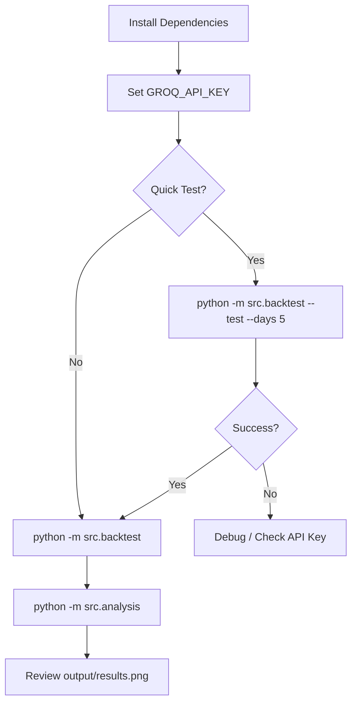

# Commands Reference

This document explains all the commands available to run the Agentic Dissonance framework.

---

## Prerequisites

Before running any commands, ensure you have:

1. **Python 3.9+** installed
2. **Dependencies installed**:
   ```powershell
   pip install -r requirements.txt
   ```
3. **GROQ API key set**:
   ```powershell
   # Windows PowerShell
   $env:GROQ_API_KEY = "your-groq-api-key"
   
   # Windows CMD
   set GROQ_API_KEY=your-groq-api-key
   
   # Linux/Mac
   export GROQ_API_KEY="your-groq-api-key"
   ```

---

## Command 1: Quick Test Backtest

```powershell
python -m src.backtest --test --days 5
```

### What It Does

This command runs a **quick validation test** of the entire debate pipeline on a limited number of days.

### Detailed Breakdown

| Step | Action |
|------|--------|
| 1 | Loads or fetches AAPL market data from yfinance |
| 2 | Selects the **first 5 trading days** from the dataset |
| 3 | For each day, runs the full 3-round debate protocol |
| 4 | Prints verbose output showing each debate round |
| 5 | Returns a DataFrame with results (does NOT save to CSV) |

### When To Use

- **First-time setup**: Verify your API key works
- **Testing changes**: Quick validation after modifying code
- **Demo purposes**: Show the debate protocol in action

### Example Output

```
Running quick test with 5 days...

============================================================
Starting Debate for 2024-01-02
============================================================

--- Round 1/3 ---
Fundamental: score=0.35
Sentiment:   score=-0.20

--- Round 2/3 ---
Fundamental: score=0.28
Sentiment:   score=-0.15

--- Round 3/3 ---
Fundamental: score=0.30
Sentiment:   score=-0.10

--- Final Metrics ---
Scalar Disagreement: 0.2828
Semantic Divergence: 0.1543
```

### Arguments

| Argument | Description |
|----------|-------------|
| `--test` | Enable test mode (required for quick test) |
| `--days N` | Number of days to process (default: 5) |

---

## Command 2: Full Backtest

```powershell
python -m src.backtest
```

### What It Does

This command runs the **complete backtest** across all trading days of 2024 (approximately 252 days), executing debates for each day and saving results.

### Detailed Breakdown

| Step | Action |
|------|--------|
| 1 | Loads market data for AAPL from 2024-01-01 to 2024-12-31 |
| 2 | Creates `data/raw_market_data.csv` if it doesn't exist |
| 3 | Iterates through **every trading day** |
| 4 | For each day: |
|   | → Fetches market context (price, returns, volatility) |
|   | → Fetches news headlines via RSS (respecting no look-ahead) |
|   | → Runs 3-round debate between Fundamental and Sentiment agents |
|   | → Computes scalar and semantic disagreement metrics |
| 5 | Saves checkpoint every 5 days to `data/disagreement_signals.csv` |
| 6 | Handles rate limits with automatic retry and delays |

### Output File

Creates `data/disagreement_signals.csv` with columns:

| Column | Type | Description |
|--------|------|-------------|
| `date` | string | Trading date (YYYY-MM-DD) |
| `disagreement_scalar` | float | std([score_fundamental, score_sentiment]) |
| `disagreement_semantic` | float | 1 - cosine_similarity(reasoning embeddings) |
| `score_fundamental` | float | Fundamental agent's final score [-1, 1] |
| `score_sentiment` | float | Sentiment agent's final score [-1, 1] |

### Estimated Runtime

| Days | Approx. Time |
|------|--------------|
| 5 | ~2 minutes |
| 50 | ~20 minutes |
| 252 (full year) | ~2 hours |

*Times vary based on API rate limits and network latency*

### Resume Capability

If the backtest is interrupted, you can resume from a specific date:

```powershell
python -m src.backtest --resume 2024-06-15
```

This will:
1. Load existing results from `data/disagreement_signals.csv`
2. Keep all results before 2024-06-15
3. Continue processing from 2024-06-15 onwards

---

## Command 3: Statistical Analysis

```powershell
python -m src.analysis
```

### What It Does

This command performs **statistical analysis** on the disagreement signals to test if they predict future volatility.

### Detailed Breakdown

| Step | Action |
|------|--------|
| 1 | Loads `data/disagreement_signals.csv` |
| 2 | Loads `data/raw_market_data.csv` |
| 3 | Computes **5-day forward realized volatility** for each day |
| 4 | Aligns D_t (disagreement at time t) with σ_{t+1:t+5} (future vol) |
| 5 | Runs **correlation analysis** (Pearson + Spearman) |
| 6 | Runs **OLS regression**: Forward_Vol ~ Scalar + Semantic |
| 7 | Runs **GARCH-X model** with disagreement as exogenous variable |
| 8 | Generates visualization saved to `output/results.png` |
| 9 | Prints detailed analysis report |

### Statistical Tests Performed

#### Correlation Analysis
- **Pearson correlation**: Linear relationship strength
- **Spearman correlation**: Rank-based (robust to outliers)

#### OLS Regression
```
Forward_Volatility = β₀ + β₁×Scalar_Disagreement + β₂×Semantic_Divergence + ε
```

Reports: R², Adjusted R², F-statistic, coefficient p-values

#### GARCH-X Model
```
σ²_t = ω + α×ε²_{t-1} + β×σ²_{t-1} + γ×D_{t-1}
```

Compares AIC of GARCH-X vs standard GARCH to assess predictive value.

### Output Files

| File | Content |
|------|---------|
| `output/results.png` | 4-panel visualization |

### Visualization Panels

1. **Top-Left**: Scatter plot of Scalar Disagreement vs Forward Volatility
2. **Top-Right**: Scatter plot of Semantic Divergence vs Forward Volatility
3. **Bottom-Left**: Time series overlay of disagreement and volatility
4. **Bottom-Right**: Summary statistics and interpretation

### Example Output

```
============================================================
ANALYSIS: Disagreement vs Forward Volatility
============================================================

1. Loading data...
   Disagreement signals: 247 days
   Market data: 252 days

2. Calculating forward volatility...

3. Merging datasets...
   Merged dataset: 242 days

4. Running correlation analysis...
   Scalar Disagreement vs Vol: r=0.2341 (p=0.0023)
   Semantic Divergence vs Vol: r=0.1856 (p=0.0142)

5. Running OLS regression...
   R² = 0.0892
   Adjusted R² = 0.0815

6. Running GARCH-X analysis...
   GARCH-X AIC: 1245.32
   GARCH   AIC: 1251.78
   Improvement: 6.46

7. Creating visualization...

============================================================
ANALYSIS COMPLETE
Results saved to: output/results.png
============================================================
```

---

## Complete Workflow



---

## Troubleshooting

| Issue | Solution |
|-------|----------|
| `GROQ_API_KEY not set` | Set environment variable before running |
| Rate limit errors | Script handles automatically with retries |
| `FileNotFoundError: disagreement_signals.csv` | Run backtest first |
| Partial results | Use `--resume` to continue from last checkpoint |
| Low correlation | Normal - not all days show predictive signal |
